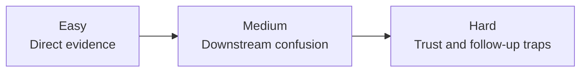
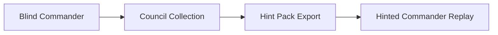

# SPECTRA

SPECTRA is a deterministic OpenEnv benchmark for production incident response under enforced partial observability. It evaluates whether an agent can recover the right service for the right reason, not whether it can blindly react to the loudest metric.

The benchmark now supports two honest execution modes:

- `multi_agent`: three specialists inspect disjoint state partitions and the commander acts on serialized reports
- `single_agent`: one commander receives the full world state for local-model baselines, hint replays, and training comparisons

The repo is built around three practical outcomes:

1. a judge-facing council demo
2. a trace and dataset collection pipeline
3. a hint-pack plus GRPO training workflow

For the step-by-step runbook, start with [execution.md](execution.md).

## Submission Snapshot

Submission targets:

- GitHub repository: `https://github.com/Madhav-GPT/multi-agent-env`
- Hugging Face Space: `https://huggingface.co/spaces/Madhav189/multi-agent-env`

Submission-critical root files:

- `demo.py`
- `inference.py`
- `run_demo.py`
- `README.md`
- `execution.md`
- `Dockerfile`
- `openenv.yaml`
- `server/app.py`

Current local validation snapshot:

- test suite: `23 passed`
- `openenv validate .`: one remaining packaging issue, `uv.lock` is missing
- server entrypoint shape is wired for OpenEnv validation (`server = "server.app:main"`)

## Why This Benchmark Matters

Many agent benchmarks grade local correctness inside a single observation stream. Real incident response is messier:

- infrastructure symptoms are often downstream of the root cause
- the loudest specialist is not always the most trustworthy one
- the correct recovery action depends on workflow stage, not just service health
- successful runs need both correct diagnosis and correct action ordering

SPECTRA is useful because it forces the agent to work under disagreement and partial visibility while staying deterministic enough for benchmarking and training.

## Why It Is Non-Trivial

The benchmark is intentionally designed around coordination traps:

- `broken_auth_cascade` makes infra evidence point to cache even though auth is the real origin
- `worker_supply_chain_compromise` makes database and gateway look unhealthy even though the worker release is poisoned
- `cache_poisoning_campaign` makes `api-gateway` look unstable while cache is the real problem
- multi-agent reward only pays when the commander calibrates trust correctly instead of following the noisiest report

Bad pattern:

```text
cache is hottest
-> isolate cache
-> restart cache
-> incident keeps spreading because auth_service is the real source
```

Good pattern:

```text
compare specialist evidence
-> request the right follow-up when needed
-> isolate the real root-cause service
-> roll back the bad config or release
-> recover the service
-> submit the final resolution
```

## Evaluation Gap

| Property | Simple ops benchmark | SPECTRA |
| --- | --- | --- |
| Observation | one stream | one full-state mode plus one partitioned multi-agent mode |
| Failure model | broken service only | causal outage with specialist disagreement and stage-gated recovery |
| Agent role | troubleshooter | commander who must interpret specialist evidence |
| Training value | trace demo only | trace export, hint export, and GRPO replay |
| Trust signal | mostly absent | explicit trust calibration reward |
| Benchmark style | symptom repair | investigate -> contain -> remediate -> recover -> summarize |

## Benchmark Mechanics

Named mechanics that shape behavior:

- specialist partitioning across metrics, logs, and security telemetry
- stage-gated action space (`triage`, `containment`, `remediation`, `recovery`, `retrospective`)
- deterministic scenario catalog with authored traps
- multi-agent trust calibration reward
- single-agent replay mode for local baselines and hint reuse
- trace export, dataset export, and hint-pack export from the same environment run

These mechanics are explicit in the environment state and reward function. They are not hidden in an LLM grader.

## At A Glance

| Item | Value |
| --- | --- |
| Environment name | `spectra_main` |
| Environment count | 1 orchestrator with 3 specialist sub-environments |
| Scenario count | 5 |
| Difficulty levels | Easy, Medium, Hard |
| Public actions | 7 |
| Score type | deterministic, dense, bounded to `[0.0, 1.0]` |
| Main runner | `inference.py` |
| Council demo | `demo.py` |
| Terminal walkthrough | `run_demo.py` |
| API entrypoint | `server/app.py` |
| Tests | `23 passed` |
| OpenEnv validation | one remaining issue: missing `uv.lock` |

## Scenario Pack

| Scenario | Difficulty | Root service | Core twist |
| --- | --- | --- | --- |
| `database_sqli_outage` | easy | `database` | SQL injection overloads the login path and drags the gateway down |
| `api_gateway_xss` | medium | `api-gateway` | reflected XSS poisons responses and makes gateway recovery ordering matter |
| `broken_auth_cascade` | hard | `auth_service` | cache looks hottest, but auth is the real source of the storm |
| `worker_supply_chain_compromise` | hard | `worker` | poisoned worker release destabilizes database and gateway downstream |
| `cache_poisoning_campaign` | medium | `cache` | header confusion makes `api-gateway` look guilty while cache is the origin |

Difficulty progression:

```text
Easy   -> direct evidence, straightforward containment
Medium -> misleading downstream symptoms and recovery ordering
Hard   -> decoy evidence, follow-up decisions, and trust calibration pressure
```



## Two Honest Modes

### Multi-Agent

`multi_agent` is the benchmark-defining mode:

- `InfraEnv` exposes only metrics
- `LogEnv` exposes only logs
- `SecEnv` exposes only security telemetry
- specialists produce `SpecialistReport` objects
- the commander acts on reports, not raw hidden state

This is the mode used for:

- council demo phases
- hosted and local multi-agent collection
- hint-pack generation
- trust-calibration reward

### Single-Agent

`single_agent` is the honest baseline mode:

- one commander receives a full-state observation
- no specialist reports are used for reward
- coordination and trust reward components collapse to `0.0`
- it is the clean path for blind local baselines and hinted replays

This is the mode used for:

- `make untrained`
- `make hinted`
- local model comparisons
- replay-backed GRPO experiments

## Public Action Schema

Only these `action_type` values are valid:

```json
[
  "investigate_service",
  "request_followup",
  "isolate_service",
  "rollback_config",
  "scale_service",
  "restart_service",
  "submit_resolution"
]
```

Required fields:

| Action | Required fields |
| --- | --- |
| `investigate_service` | `target_service` |
| `request_followup` | `target_agent` |
| `isolate_service` | `target_service` |
| `rollback_config` | `target_service` |
| `scale_service` | `target_service` |
| `restart_service` | `target_service` |
| `submit_resolution` | `resolution_summary` |

Valid agent targets:

- `infra`
- `log`
- `security`

Valid service targets:

- `api-gateway`
- `database`
- `cache`
- `worker`
- `auth_service`

## Stage-Gated Workflow

The environment narrows the legal action family by workflow stage:

| Stage | Goal | Representative allowed actions |
| --- | --- | --- |
| `triage` | narrow likely cause | `request_followup`, `investigate_service`, `isolate_service` |
| `containment` | contain the root service | `request_followup`, `isolate_service`, `rollback_config` |
| `remediation` | remove the bad config or release | `rollback_config`, `restart_service`, `scale_service` |
| `recovery` | restore stability | `restart_service`, `scale_service`, `submit_resolution` |
| `retrospective` | close the loop | `submit_resolution` |
| `done` | episode complete | none |

This keeps the benchmark deterministic while preventing degenerate "always restart everything" policies.

## Observation Design

The public observation contract is explicit and machine-usable. Depending on mode, the commander sees:

- `prompt_text`
- `workflow_stage`
- `allowed_actions`
- `stage_goal`
- `required_fields_by_action`
- `valid_action_example`
- `progress_flags`
- `common_trap`
- `last_action_result`
- `reward_breakdown`
- `cumulative_reward`
- `difficulty`
- `scenario_id`
- `scenario_name`
- `step_budget`
- `loop_warning`
- `done`

Mode-specific payload:

- `multi_agent`: `reports`, `specialist_executions`, `commander_execution`
- `single_agent`: full-state prompt text with the same stage/action scaffolding

## Scoring

The total score is deterministic and clamped to `[0.0, 1.0]`.

```text
total =
  R1 resolution        up to 0.50 +
  R2 root-cause        up to 0.20 +
  R3 coordination      up to 0.15 +
  R4 efficiency        up to 0.10 +
  R5 trust calibration up to 0.05 +
  wrong-target penalty down to -0.10
```

Reward components:

| Component | Maximum | Meaning |
| --- | ---: | --- |
| `R1` resolution | `0.50` | submit a complete successful resolution, or `0.20` for partial recovery |
| `R2` root-cause | `0.20` | first move targets the real service or requests the best follow-up agent |
| `R3` coordination | `0.15` | in multi-agent mode, the commander acts on aligned specialist evidence |
| `R4` efficiency | `0.10` | fewer steps used before resolution yields higher reward |
| `R5` trust calibration | `0.05` | in decoy scenarios, the commander ultimately trusts the right agent |
| wrong-target penalty | `-0.10` | action targets the wrong service |

Important mode note:

- `R3` and `R5` only apply in `multi_agent`
- `single_agent` still gets resolution, root-cause, efficiency, and wrong-target penalty

## Runtime Flow

### Standard inference loop

```text
model
  -> inference.py
  -> local or remote POMIREnv
  -> observation + reward + artifacts
  -> next model decision
```

### Council demo flow

```text
phase 1: untrained single-agent baseline
  -> phase 2: multi-agent council collection
  -> phase 3: hinted single-agent replay
```



## Artifacts Produced

The repo is designed to export reusable artifacts instead of only pretty logs.

Main output families:

- `outputs/untrained/` for blind single-agent runs
- `outputs/multi_agent/` for trace, JSONL, and hint-pack collection
- `outputs/hinted/` for hinted single-agent replays
- `outputs/council_pipeline/` for the full council experience
- `outputs/grpo_smoke/` and `outputs/grpo_runs/` for training experiments

Multi-agent collection writes:

- `data.jsonl`
- `data.summary.json`
- `traces/`
- `hints.json`

That means one environment run can feed both evaluation and training.

## Repository Layout

Key directories:

- `agents/`: commander logic, specialist logic, prompts, observation builders
- `environments/`: orchestrator plus infra, log, and security sub-environments
- `rewards/`: deterministic reward components
- `training/`: dataset replay, hint building, and GRPO entrypoints
- `eval/`: condition comparison, trust probe, and hint-effect analysis
- `runtime/`: terminal rendering and `.env` loading helpers
- `server/`: top-level FastAPI/OpenEnv wrapper
- `spaces/multi-agent-env/`: separate Hugging Face Space checkout used for deployment sync

## Environment Variables

`.env` is optional and loaded automatically if present. The template lives in `.env.example`.

Common runtime variables:

- `HF_TOKEN`
- `INFRA_SPECIALIST_MODEL`
- `INFRA_SPECIALIST_PROVIDER`
- `LOG_SPECIALIST_MODEL`
- `LOG_SPECIALIST_PROVIDER`
- `SEC_SPECIALIST_MODEL`
- `SEC_SPECIALIST_PROVIDER`
- `COMMANDER_PROVIDER`
- `COMMANDER_MODEL`
- `COMMANDER_HF_PROVIDER`
- `API_BASE_URL`
- `OPENAI_API_KEY`

Practical defaults in the repo:

- hosted multi-agent commander: `Qwen/Qwen3-4B-Instruct-2507` via `hf`
- hosted specialists: Qwen variants via `nscale`
- local commander endpoint: `http://127.0.0.1:11434/v1`
- local demo and replay model: `qwen2.5:3b` or `qwen2.5:1.5b`

## Quickstart

Fastest first run:

```bash
cd /Users/madhav_189/Documents/Scalar_hackathon/Madhav_task
make doctor
./.venv/bin/python -m pytest tests -q
make demo SCENARIO=broken_auth_cascade
```

Most useful end-to-end local pipeline:

```bash
make council-local
```

Hosted collection path:

```bash
make multi-agent-smoke SCENARIO=broken_auth_cascade COMMANDER_MODEL=Qwen/Qwen3-4B-Instruct-2507
```

Detailed run instructions live in [execution.md](execution.md).

## Validation And Deployment Notes

What currently passes locally:

- `./.venv/bin/python -m pytest tests -q`
- `demo.py --help`
- `inference.py --help`

What still blocks a completely clean `openenv validate .`:

- `uv.lock` has not been generated in the repo yet

Once `uv lock` is generated, the remaining OpenEnv packaging checks are already wired:

- `server = "server.app:main"` is present in `pyproject.toml`
- `server/app.py` exposes a callable `main()`

## What To Run First

If you are evaluating the repo as a benchmark:

- `make demo` for the judge-facing story
- `make multi-agent-smoke` for benchmark artifact generation
- `make hinted-check` for blind versus hinted comparison
- `make train-smoke` for replay-backed training validation

If you are evaluating the repo as an OpenEnv submission:

- read [execution.md](execution.md)
- run the local test suite
- generate `uv.lock`
- re-run `openenv validate .`
